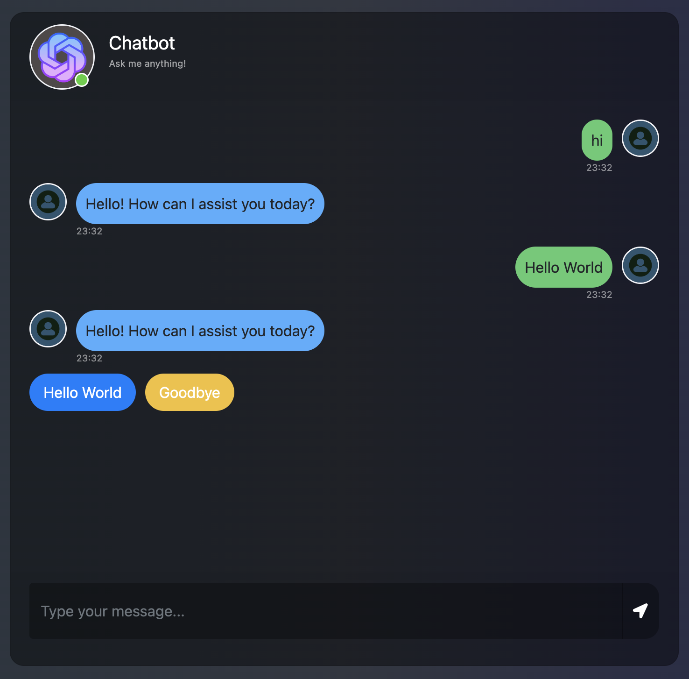

# Flask ChatBot With Quick Replies
## Introduction
This project is based on the code from [BinaryHood](https://github.com/binary-hood/ChatBot-Starter). I have added the option for the chatbot to send a quick reply button, which the user can click instead of typing a response.

## Installation & Setup

[Install Python] https://www.dataquest.io/blog/installing-python-on-mac/

[Install pip] https://phoenixnap.com/kb/install-pip-mac

If you have Python & pip installed then check their version in the terminal or command line tools

```
python3 --version
```

```
pip --version
```

Get a OpenAi API key. Create a .env file in the root of the project.
```
echo "OPENAI_API_KEY=<openaikey>" > .env
```

## Installing Flask

In your terminal run the requirements.txt file using this pip

```
pip install -r requirements.txt
```


## Running ChatBot Application in Terminal

```
cd into your directory
```

```
python app.py
```

# User-Html

```
var userHtml = '<div class="d-flex justify-content-end mb-4"><div class="msg_cotainer_send">' + user_input + '<span class="msg_time_send">'+ time + 
    '</span></div><div class="img_cont_msg"></div></div>';
```

# Bot-HTML

```
var botHtml = '<div class="d-flex justify-content-start mb-4"><div class="img_cont_msg"></div><div class="msg_cotainer">' + bot_response + '<span class="msg_time">' + time + '</span></div></div>';
```
## Aditional feautres
### Light/Dark mode


### Quick replies


